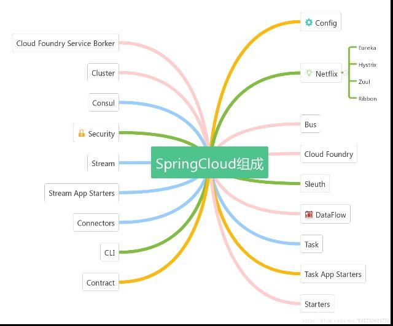

# Spring Cloud 

> 自己学习的一些总结。

## 微服务
微服务与传统的架构相比的好处：
1. 语言无关
2. 独立的进程通信
3. 高度解耦
4. 按需求扩展等

目前主流的微服务架构：
[Spring Cloud](#spring-cloud-1)、Dubbo、API Gateway等

 
## Spring Cloud 
Spring Cloud是一套快速构建分布式系统中常见工具的集合，利用Spring Boot的开发便利性，Spring Cloud为JVM云应用开发中的配置管理、服务发现、断路器、智能路由、微代理、控制总线、全局锁、决策竞选、分布式会话和集群状态管理等操作提供了一种简单的实现方式。

Spring Cloud并没有重复制造轮子，它只是将目前各家公司开发的比较成熟、经得起实际考验的服务框架组合起来，通过Spring Boot风格进行再封装屏蔽掉了复杂的配置和实现原理，最终给开发者留出了一套简单易懂、易部署和易维护的分布式系统开发工具包。

Spring Cloud中文网： https://springcloud.cc/spring-cloud-dalston.html
#### Spring Cloud 的特性
- 分布式/版本化配置
- 服务注册和发现
- 路由
- service - to - service调用
- 负载均衡
- 断路器
- 分布式消息传递

#### Spring Cloud 的组成

Spring Cloud的子项目，大致可分成两类，一类是对现有成熟框架”Spring Boot化”的封装和抽象，也是数量最多的项目；第二类是开发了一部分分布式系统的基础设施的实现，如Spring Cloud Stream扮演的就是kafka, ActiveMQ这样的角色。

 

#### Spring Cloud Netflix
> Spring Cloud Netflix是对Netflix开发的一套分布式服务框架的封装，包括服务的发现和注册，负载均衡、断路器、REST客户端、请求路由等。

- 服务发现——Netflix Eureka
- 客服端负载均衡——Netflix Ribbon
- 断路器——Netflix Hystrix
- 服务网关——Netflix Zuul

#### Spring Cloud Config
> 分布式配置

> 将配置信息中央化保存, 配置Spring Cloud Bus可以实现动态修改配置文件

#### Spring Cloud Bus
> 分布式消息队列，是对Kafka, MQ的封装

#### Spring Cloud Security
> 对Spring Security的封装，并能配合Netflix使用

#### Spring Cloud Zookeeper
> 对Zookeeper的封装，使之能配置其它Spring Cloud的子项目使用

#### Spring Cloud Eureka
> Spring Cloud Eureka 是 Spring Cloud Netflix 微服务套件中的一部分，它基于Netflix Eureka 做了二次封装，主要负责完成微服务架构中的服务治理功能（服务注册与发现）。

## Spring Cloud 与 Dubbo
- [Spring Cloud 与 Dubbo的区别](SpringCloud-Dubbo.MD)

